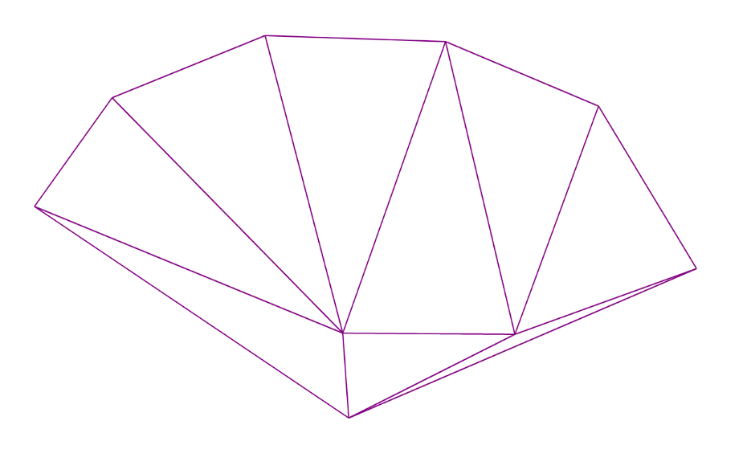

# Триангуляция Делоне 
***Формулировка задачи:*** по заданному множеству точек на плоскости построить триангуляцию, удовлетворяющую условию Делоне.

## Конечный результат
1. *Библиотека delaunayTriangulation*, содержащая функцию *getTriangulation()*, которая будет возвращать
вектор из треугольников, составляющих построенную триангуляцию.
2. *Консольное приложение*, визуализирующее построенную триангуляцию. Будет принимать на вход координаты
точек(пары действительных чисел) и на выходе будет давать изображение построенной триангуляции. \
__Входные данные(вводятся в консоль)__ \
  x1 y1 \
  x2 y2 \
  ... \
  xn yn \
__Примерный результат работы консольного приложения:__ \


---
## Немного о примерной реализации
1. *Структуры данных:* 
```c++
struct Point {
	double x_ = 0;
	double y_ = 0;
	Point(double x, double y) {
		x_ = x;
		y_ = y;
	}
};

struct Triangle {
	std::vector<Point*> vertices;

	Triangle(Point* A, Point* B, Point* C) {
		vertices.push_back(A);
		vertices.push_back(B);
		vertices.push_back(C);
	}
};
```
\
2. ***Итеративный алгоритм*** \
*Идея: разбить построение триангуляции на две основные фазы:*
- Создание на заданном множестве точек **произвольной** триангуляции: создание и триангуляция минимальной выпуклой оболочки(МВО) множества
заданных точек, и поочередное добавления точек, не входящих в МВО. 
- Перестраивание полученной триангуляции под условие Делоне с помощью “флипов”.

